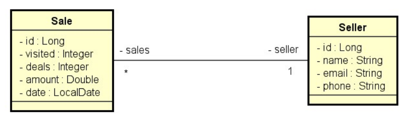

# **Desafio 04 - Curso Java Spring Expert: Módulo 04**
### Enunciado
Trata-se de um sistema de vendas (Sale) e vendedores (Seller). Cada venda está para um vendedor, e um vendedor pode ter várias vendas.
Você deverá implementar as seguintes consultas (ambas deverão estar corretas):

### Modelo de Domínio


### Casos de Uso
- Relatório de vendas
  1. [IN] O usuário informa, opcionalmente, data inicial, data final e um trecho do nome do vendedor.
  2. [OUT] O sistema informa uma listagem paginada contendo id, data, quantia vendida e nome do
vendedor, das vendas que se enquadrem nos dados informados.
Informações complementares:
- Se a data final não for informada, considerar a data atual do sistema. Para instanciar a data atual,
utilize o comando:
```
LocalDate today = LocalDate.ofInstant(Instant.now(), ZoneId.systemDefault());
```
- Se a data inicial não for informada, considerar a data de 1 ano antes da data final. Para instanciar
uma data com um ano a menos, use a função minusYears:
```
LocalDate result = minhaData.minusYears(1L);
```
- Se o nome não for informado, considerar o texto vazio.
Dica: receba todos os dados como String no controller, e faça os tratamentos das datas acima,
instanciando os objetos LocalDate, no service.

- Sumário de vendas por vendedor
  1. [IN] O usuário informa, opcionalmente, data inicial, data final.
  2. [OUT] O sistema informa uma listagem contendo nome do vendedor e soma de vendas deste vendedor
no período informado.
Informações complementares:
 - As mesmas do caso de uso Relatório de vendas.

### Critérios de Correção
- Sumário de vendas por vendedor passando argumentos minDate e maxDate deve retornar os dados previstos no enunciado (eliminatório);
- Sumário de vendas por vendedor sem passar argumentos deve retornar os dados dos últimos 12 meses (eliminatório);
- Relatório de vendas sem passar argumentos deve retornar vendas dos últimos 12 meses (eliminatório);
- Relatório de vendas passando argumentos minDate e maxDate deve retornar os dados previstos no enunciado (eliminatório).

### Competências avaliadas:
- Realização de casos de uso;
- Criação de endpoints de API Rest com parâmetros de consulta opcionais;
- Implementação de consultas em banco de dados relacional com Spring Data JPA.
